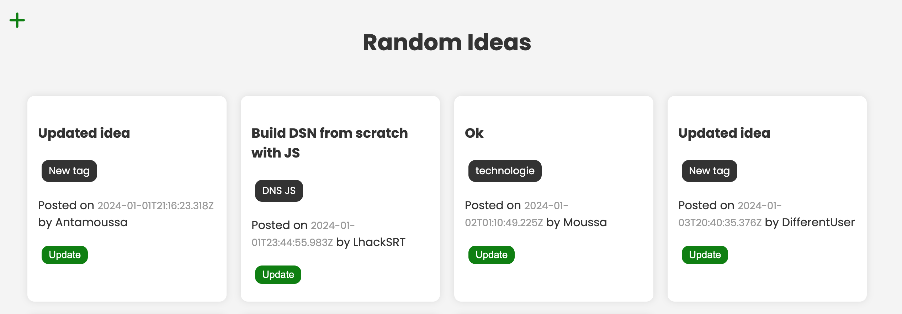

# RandomIdeas API with Node.js, Express, and MongoDB

This repository contains the source code for a RESTful API built with Node.js and Express to manage random ideas. The API allows users to perform CRUD operations (Create, Read, Update, Delete) on a MongoDB database.
```

```


# Install Dependencies

## Install dependencies on the front-end and back-end

```bash
npm install
cd client
npm install
```

## Back-end/Express Server

```bash
npm start
```

or

```bash
npm run dev (Nodemon)
```

Visit [http://localhost:5000](http://localhost:5000)

## Front-end/Webpack Dev Server

```bash
cd client
npm run dev
```

Visit [http://localhost:3000](http://localhost:3000)

## To build front-end production files

```bash
cd client
npm run build
```

The production build will be put into the public folder, which is the Express static folder.

## Environment Variables

Rename `.env-example` to `.env` and add your MongoDB URI to the `.env` file.

```plaintext
MONGO_URI=your_mongodb_uri
```
## Features
- **Create:** Add new random ideas with details.
- **Read:** Retrieve a list of random ideas or specific ideas by ID.
- **Update:** Modify existing ideas with new information.
- **Delete:** Remove random ideas from the database.

## Technologies Used
- **Node.js:** Backend JavaScript runtime environment.
- **Express:** Fast, unopinionated, minimalist web framework for Node.js.
- **MongoDB:** NoSQL database used for storing random idea information.
- **Mongoose:** MongoDB object modeling for Node.js, providing schema-based solutions.

## Project Structure
The project follows a modular structure:
- **Controllers:** Handle incoming requests, interact with services.
- **Services:** Implement business logic, interact with models.
- **Models:** Define data schema, interact with the database.
- **Client Src:** Frontend components for interacting with the API.

## Setup Instructions
1. Clone this repository.
2. Install dependencies using `npm install`.
3. Configure the MongoDB connection settings.
4. Run the server with `npm start`.

## API Endpoints
- **GET /ideas:** Retrieve all random ideas.
- **GET /ideas/:id:** Retrieve a specific idea by ID.
- **POST /ideas:** Create a new random idea.
- **PUT /ideas/:id:** Update an existing idea by ID.
- **DELETE /ideas/:id:** Delete an idea by ID.

## Testing
The application includes tests covering various functionalities, with the test framework of js, **JEST**:
- **GET:** Tests to retrieve random ideas and specific ideas by ID.
- **POST:** Tests to create new random ideas.
- **PUT:** Tests to update existing ideas.
- **DELETE:** Tests to delete existing ideas.

Feel free to contribute, report issues, or suggest enhancements by opening a pull request or creating an issue.


